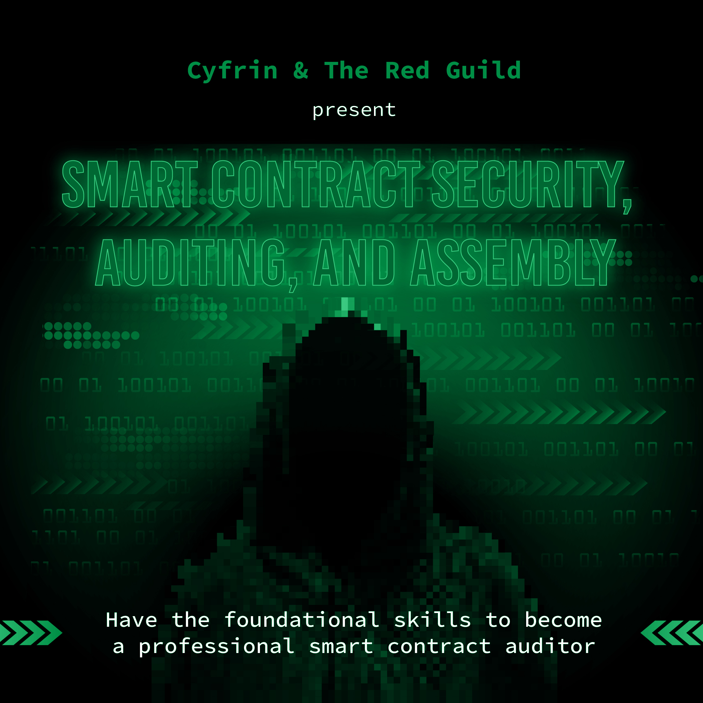
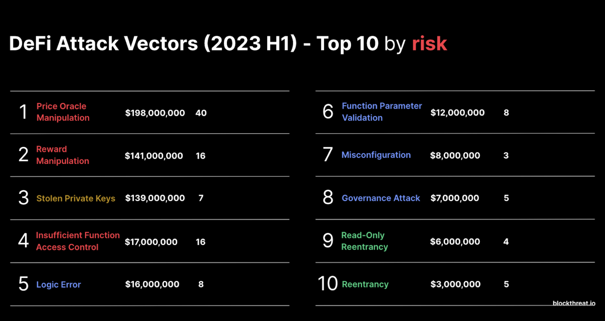
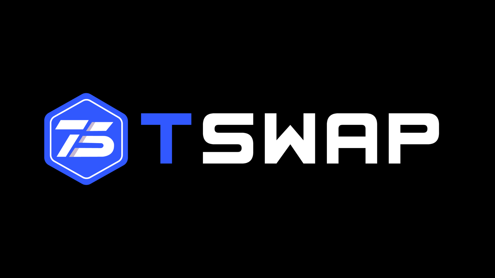
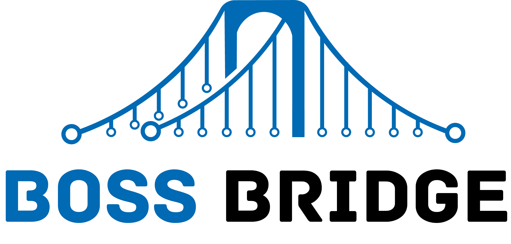

[contributors-shield]: https://img.shields.io/github/contributors/cyfrin/security-and-auditing-full-course-s23.svg?style=for-the-badge
[contributors-url]: https://github.com/cyfrin/security-and-auditing-full-course-s23/graphs/contributors
[forks-shield]: https://img.shields.io/github/forks/cyfrin/security-and-auditing-full-course-s23.svg?style=for-the-badge
[forks-url]: https://github.com/cyfrin/security-and-auditing-full-course-s23/network/members
[stars-shield]: https://img.shields.io/github/stars/cyfrin/security-and-auditing-full-course-s23.svg?style=for-the-badge
[stars-url]: https://github.com/cyfrin/security-and-auditing-full-course-s23/stargazers
[issues-shield]: https://img.shields.io/github/issues/cyfrin/security-and-auditing-full-course-s23.svg?style=for-the-badge
[issues-url]: https://github.com/cyfrin/security-and-auditing-full-course-s23/issues
[license-shield]: https://img.shields.io/github/license/cyfrin/security-and-auditing-full-course-s23.svg?style=for-the-badge
[license-url]: https://github.com/cyfrin/security-and-auditing-full-course-s23/blob/master/LICENSE.txt
[linkedin-shield]: https://img.shields.io/badge/-LinkedIn-black.svg?style=for-the-badge&logo=linkedin&colorB=555

<h1 align="center"> Smart Contract Auditing, Assembly, Security, and DeFi Ultimate Course
 </h1>

<p align="center"><strong> Level up your career as a smart contract auditor writing secure and optimized smart contracts. 
</strong></p>

<div align="center">

[![Stargazers][stars-shield]][stars-url] [![Forks][forks-shield]][forks-url]
[![Contributors][contributors-shield]][contributors-url]
[![Issues][issues-shield]][issues-url]
[![MIT License][license-shield]][license-url]

<p align="center">
    <br />
    <a href="https://cyfrin.io/">
        </a>
<a href="https://updraft.cyfrin.io/courses/security">
        </a>
    <br />
</p>

And [The Red Guild](https://theredguild.org/)

</div>

Welcome to the repository for the Ultimate Smart Contract Auditing, Assembly, Security, and DeFi Course by Cyfrin Updraft and The Red Guild!

This repository houses the written content of our courses, organized to facilitate easy access and contribution from our community.
Please refer to this for an in-depth explanation of the content:

-   [Website](https://updraft.cyfrin.io/) - Join Cyfrin Updraft and enjoy 50+ hours of smart contract development courses
-   [Twitter](https://twitter.com/cyfrinupdraft) - Stay updated with the latest course releases
-   [LinkedIn](https://www.linkedin.com/school/cyfrin-updraft/) - Add Updraft to your learning experiences
-   [Discord](http://discord.gg/cyfrin) - Join a community of 3000+ developers and auditors
-   [Newsletter](https://www.cyfrin.io/newsletter) - Weekly security research tips and resources to level up your career
-   [Codehawks](https://www.codehawks.com/) - Smart contracts auditing competitions to help securing web3

</br>

<br/>
<p align="center">
<a href="https://updraft.cyfrin.io/" target="_blank">

</a>
</p>
<br/>

# Table of Contents

_Note: If you're familiar with Patrick's previous courses, we have renamed "Lessons" to "Sections"_
## Smart Contract Auditing, Assembly, Security, and DeFi Ultimate Course
<details>
<summary>Smart Contract Auditing, Assembly, Security, and DeFi Ultimate Course</summary>
<ol>
<li><a href="#smart-contract-auditing-assembly-security-and-defi-ultimate-course">Smart Contract Auditing, Assembly, Security, and DeFi Ultimate Course</a></li>
</ol>
</details>
<details>
<summary>Table of Contents</summary>
<ol>
<li><a href="#table-of-contents">Table of Contents</a></li>
</ol>
</details>
<details>
<summary>Introduction, Resources, and Prerequisites</summary>
<ol>
<li><a href="#link-to-video-coming-soon">Link to video: *Coming soon...*</a></li>
<li><a href="#resources-for-this-course">Resources For This Course</a></li>
<li><a href="#prerequisites">Prerequisites</a></li>
<li><a href="#outcome">Outcome</a></li>
<li><a href="#bonus-nfts">Bonus NFTs</a>
  <ul>
    <li><a href="#important-notes-for-arbitrum">Important Notes for Arbitrum</a></li>
    <li><a href="#bridging-to-arbitrum">Bridging to Arbitrum</a></li>
  </ul>
</li>
</ol>
</details>
<details>
<summary><a href="#curriculum">Curriculum</a></summary>
<ol>
<li><a href="#curriculum">Curriculum</a></li>
</ol>
</details>
<details>
<summary><a href="#-section-0-welcome-to-the-course">🤗 Section 0: Welcome to the Course</a></summary>
<ol>
<li><a href="#welcome">Welcome</a></li>
<li><a href="#why-security">Why Security?</a></li>
<li><a href="#why-web3-is-so-important">Why Web3 is so important</a></li>
<li><a href="#the-final-boss-codebase-youll-be-able-to-audit-this-at-the-end-of-this-course">The Final Boss Codebase, you'll be able to audit this at the end of this course</a></li>
<li><a href="#best-practices-for-this-course">Best Practices for this course</a></li>
<li><a href="#section-0-nft">Section 0 NFT</a></li>
</ol>
</details>
<details>
<summary><a href="#-section-1-review-dont-skip">🐸 Section 1: Review (Don't skip)</a></summary>
<ol>
<li><a href="#section-1-nft">Section 1 NFT</a></li>
</ol>
</details>
<details>
<summary><a href="#-section-2-what-is-a-smart-contract-audit-security-review">❓ Section 2: What is a smart contract audit (Security Review)?</a></summary>
<ol>
<li><a href="#what-is-a-security-reviewsmart-contract-audit">What is a security review/smart contract audit?</a></li>
<li><a href="#smart-contract-development-life-cycle">Smart Contract Development Life Cycle</a></li>
<li><a href="#top-smart-contract-auditors-subjective">Top Smart Contract Auditors (Subjective!)</a></li>
<li><a href="#tooling">Tooling</a></li>
<li><a href="#audit-readiness">Audit Readiness</a></li>
<li><a href="#attacker-vs-defender-mindset">Attacker vs. Defender mindset</a></li>
<li><a href="#top-attack-vectors">Top Attack Vectors</a></li>
<li><a href="#section-2-nft">Section 2 NFT</a></li>
</ol>
</details>
<details>
<summary><a href="#️-section-3-your-first-audit-security-review--passwordstore-audit">⛳️ Section 3: Your first audit | PasswordStore Audit</a></summary>
<ol>
<li><a href="#security-review--audit">Security Review &gt; Audit</a></li>
<li><a href="#the-tincho">"The Tincho"</a></li>
<li><a href="#exploits">Exploits</a></li>
<li><a href="#exploits-access-controls">Exploits: Access Controls</a></li>
<li><a href="#writing-your-first-finding">Writing your first finding</a></li>
<li><a href="#exploits-private-data">Exploits: Private Data</a></li>
<li><a href="#your-first-report">Your first report</a></li>
<li><a href="#section-3-nft">Section 3 NFT</a></li>
</ol>
</details>
<details>
<summary><a href="#-section-4-manual--static-analysis--puppy-raffle-audit">🐶 Section 4: Manual & Static Analysis | Puppy Raffle Audit</summary>
<ol>
<li><a href="#tooling-static-analysis">Tooling: Static Analysis</a></li>
<li><a href="#scoping--reconnaissance-puppy-raffle">Scoping & Reconnaissance: Puppy Raffle</a></li>
<li><a href="#exploits-reentrancy">Exploits: Reentrancy</a></li>
<li><a href="#exploits-weak-rng">Exploits: Weak RNG</a></li>
<li><a href="#exploits-arithmetic-issues">Exploits: Arithmetic issues</a></li>
<li><a href="#exploits-dos-denial-of-service">Exploits: DoS (Denial of service)</a></li>
<li><a href="#exploits-poor-eth-handling">Exploits: Poor ETH Handling</a></li>
<li><a href="#informational-findings">Informational Findings</a></li>
<li><a href="#gas-audits">Gas Audits</a></li>
<li><a href="#code-maturity">Code Maturity</a></li>
<li><a href="#writing-the-report-puppy-raffle">Writing the report: Puppy Raffle</a></li>
<li><a href="#section-4-nft">Section 4 NFT</a></li>
</ol>
</details>
<details>
<summary><a href="#-section-5-invariants--intro-to-defi--tswap-audit">🔄 Section 5: Invariants & Intro to DeFi | TSwap Audit</a></summary>
<ol>
<li><a href="#scoping--reconnaissance-t-swap">Scoping & Reconnaissance: T-Swap</a></li>
<li><a href="#intro-to-defionchain-finance">Intro to DeFi/OnChain Finance</a></li>
<li><a href="#tooling-t-swap">Tooling: T-Swap</a></li>
<li><a href="#exploits-weird-erc20s">Exploits: Weird ERC20s</a></li>
<li><a href="#exploits-core-invariant-breaking">Exploits: Core Invariant breaking</a></li>
<li><a href="#design-patterns-t-swap">Design Patterns: T-Swap</a></li>
<li><a href="#section-5-nft">Section 5 NFT</a></li>
</ol>
</details>
<details>
<summary><a href="#️-section-6-centralization-proxies-and-oracles--thunder-loan-audit">🌩️ Section 6: Centralization, Proxies, and Oracles | Thunder Loan Audit</a></summary>
<ol>
<li><a href="#️-section-6-centralization-proxies-and-oracles--thunder-loan-audit">Section 6: Centralization, Proxies, and Oracles | Thunder Loan Audit</a></li>
<li><a href="#scoping--reconnaissance-thunder-loan">Scoping & Reconnaissance: Thunder Loan</a>
  <ul>
    <li><a href="#defi-borrowing--lending">DeFi: Borrowing & Lending</a></li>
    <li><a href="#malicious-scope">Malicious Scope</a></li>
  </ul>
</li>
<li><a href="#tooling-thunder-loan">Tooling: Thunder Loan</a>
  <ul>
    <li><a href="#exploits-failure-to-initialize">Exploits: Failure to initialize</a></li>
    <li><a href="#exploits-storage-collision">Exploits: Storage collision</a></li>
    <li><a href="#exploits-centralization">Exploits: Centralization</a></li>
    <li><a href="#exploits-missing-events">Exploits: Missing events</a></li>
    <li><a href="#exploits-bad-upgrade">Exploits: Bad Upgrade</a></li>
    <li><a href="#exploits-oracle--price-manipulation">Exploits: Oracle & Price Manipulation</a></li>
  </ul>
</li>
<li><a href="#design-patterns-thunder-loan">Design Patterns: Thunder Loan</a></li>
<li><a href="#section-6-nft">Section 6 NFT</a></li>
</ol>
</details>
<details>
<summary><a href="#-section-7-bridges-chains-signatures-intro-to-yulassembly--bridge-boss-audit">🌉 Section 7: Bridges, Chains, Signatures, Intro to Yul/Assembly | Bridge Boss Audit</a></summary>
<ol>
<li><a href="#-section-7-bridges-chains-signatures-intro-to-yulassembly--bridge-boss-audit">Section 7: Bridges, Chains, Signatures, Intro to Yul/Assembly | Bridge Boss Audit</a></li>
<li><a href="#tooling-boss-bridge">Tooling: Boss Bridge</a></li>
<li><a href="#scoping--reconnaissance-boss-bridge">Scoping & Reconnaissance: Boss Bridge</a>
  <ul>
    <li><a href="#exploits-opcode-support">Exploits: Opcode Support</a></li>
    <li><a href="#exploits-signature-replay">Exploits: Signature Replay</a></li>
    <li><a href="#exploits-erc20-contract-approval">Exploits: ERC20 Contract Approval</a></li>
    <li><a href="#exploits-unlimited-minting">Exploits: Unlimited Minting</a></li>
  </ul>
</li>
<li><a href="#bridge-hacks">Bridge Hacks</a>
  <ul>
    <li><a href="#writing-the-report-boss-bridge">Writing the report: Boss Bridge</a></li>
  </ul>
</li>
<li><a href="#design-patterns-boss-bridge">Design Patterns: Boss Bridge</a></li>
<li><a href="#section-7-nft">Section 7 NFT</a></li>
</ol>
</details>
<details>
<summary><a href="#section-8-the-final-boss-audit-mev-nodes--daos--vault-guardians-audit">🛡️ Section 8: (THE FINAL BOSS AUDIT) MEV, Nodes, & DAOs | Vault Guardians Audit</a></summary>
<ol>
<li><a href="#section-8-the-final-boss-audit-mev-nodes--daos--vault-guardians-audit">Section 8: (THE FINAL BOSS AUDIT) MEV, Nodes, & DAOs | Vault Guardians Audit</a></li>
<li><a href="#concepts-vault-guardians">Concepts: Vault Guardians</a>
  <ul>
    <li><a href="#exploits-governance-attack">Exploits: Governance Attack</a></li>
    <li><a href="#exploits-blocktimestamp-can-be-bad">Exploits: `block.timestamp` can be bad</a></li>
  </ul>
</li>
<li><a href="#introduction-to-mev">Introduction to MEV</a>
  <ul>
    <li><a href="#exploits-slippage-protection">Exploits: Slippage Protection</a></li>
  </ul>
</li>
<li><a href="#design-patterns-vault-guardians">Design Patterns: Vault Guardians</a></li>
<li><a href="#section-8-nft">Section 8 NFT</a></li>
</ol>
</details>
<details>
<summary>First CodeHawks Competitive Audit</summary>
<ol>
<li><a href="#first-codehawks-competitive-audit">First CodeHawks Competitive Audit</a></li>
</ol>
</details>

<details>
<summary>Congratulations</summary>
<ol>
<li><a href="#congratulations">Congratulations</a></li>
<li><a href="#where-do-i-go-now">Where do I go now?</a></li>
<li><a href="#learning-more">Learning More</a></li>
</ol>
</details>
<details>
<summary>Thank you</summary>
<ol>
<li><a href="#thank-you">Thank you</a></li>
<li><a href="#sponsors">Sponsors</a></li>
<li><a href="#lead-lecturers--code-builders">Lead Lecturers / Code Builders</a></li>
<li><a href="#guest-lecturers">Guest Lecturers</a></li>
<li><a href="#special-thanks">Special thanks</a></li>
<li><a href="#more-security-stuff">More Security Stuff</a></li>
<li><a href="#huge-extra-thank-you">Huge Extra Thank YOU</a></li>
</ol>
</details>

# Introduction, Resources, and Prerequisites

## Link to video: *Coming soon...*

> ⚠️ All code associated with this course is for demo purposes only. They have been audited, but we do not recommend them for production use and should be used at your own risk. 

## Resources For This Course

Join [Cyfrin Updraft](https://updraft.cyfrin.io/) for the best learning experience!

- AI Frens
  - [ChatGPT](https://chat.openai.com/)
      - Just know that it will often get things wrong, but it's very fast!
  - [Phind](https://www.phind.com/)
      - Like ChatGPT, but it searches the web
  - [Bard](https://bard.google.com/)
  - [Other AI extensions](https://twitter.com/aisolopreneur/status/1654823630155464704?s=42&t=-pu_sCYtfrfPJU7OXfifrQ)
- Github Discussions 
    -   Ask questions and chat about the course here!
-   [Stack Exchange Ethereum](https://ethereum.stackexchange.com/)
    -   Great place for asking technical questions about Ethereum
-   [Peeranha](https://peeranha.io/)
    -   Decentralized Stack Exchange!

### Exploit Resources 

- [SC Exploits Minimized](https://github.com/Cyfrin/sc-exploits-minimized)

### Challenge Contracts Registry

- [Challenge Contracts (Arbitrum)](https://arbiscan.io/address/0xDe0e797bfAd78F0615d75430C53F8fe3C9e49883#code)
- [Challenge Contracts (Sepolia)](https://sepolia.etherscan.io/token/0x31801c3e09708549c1b2c9e1cfbf001399a1b9fa#code)

## Prerequisites
An intermediate understanding of solidity. You don't need to be a pro, but you should be familiar with:

* Blockchain basics (transactions, blocks, decentralization, etc)
* Running a smart contract test suite (hardhat, foundry, truffle, etc)
* Solidity basics (variables, functions, structs, etc)

Here are some resources to get you up to speed with the prerequisites:

* [Full Foundry Course](https://www.youtube.com/watch?v=umepbfKp5rI): This will give you every single prerequisite
* [Speed Run Ethereum](https://speedrunethereum.com/): This will give you most of what you need. But you’ll need a little extra time on invariant tests, using foundry, and DeFi/OnChain Finance. 

### Prerequisite tools
- [git](https://git-scm.com/book/en/v2/Getting-Started-Installing-Git)
- [foundry](https://getfoundry.sh/)
- [VSCode other other text editor](https://code.visualstudio.com/)
- [Understand Markdown syntax](https://www.markdownguide.org/basic-syntax/)
- [ChatGPT or other AI assistant](https://chat.openai.com/chat)

## Outcome
* Have the foundational skills to become a professional smart contract auditor
* Speak, interact, and contribute to the web3 security community
* Compete in web3 competitive audits
* Compete in web3 bug bounties
* Start a career as an independent auditor
* Become a top 1% smart contract developer

## Bonus NFTs
- [You can find them on Arbitrum here](https://arbiscan.io/token/0xde0e797bfad78f0615d75430c53f8fe3c9e49883#code)
- It's just numbers 0 -> 8
  - The rest are from the [assembly and formal verification](https://updraft.cyfrin.io/courses/formal-verification) or the [Web3 DevOps](https://updraft.cyfrin.io/courses/wallet-and-deployment) course. 

### Important Notes for Arbitrum
IF YOU DECIDE TO MINT THE REAL NFT: 
1. We didn't audit/security review the NFT, so if you want to make sure you'll be safe, interact with the contract using a burner wallet (a wallet with very little money that you don't use for anything else)
   1. In fact... Get good at interacting with wallets from a burner wallet
2. Read my [Tweet thread on basic wallet safety](https://twitter.com/PatrickAlphaC/status/1663936101650685954)
3. It might be a good idea to wait till later in the course when we teach you about verifying metamask transactions. 
4. Feel free to mint NFTs on sepolia without worrying about the above

### Bridging to Arbitrum
1. We didn't show you how to bring ETH -> Arbitrum, but the process would be:
   1. Buy ETH (On an exchange like [Coinbase](https://www.coinbase.com/home) or [Kraken](https://www.kraken.com/))
2. Send ETH -> one of your wallets like:
   1. [Safe (Multi-Sig)](https://safe.global/)
   2. [Metamask](https://metamask.io/)
   3. [Frame](https://frame.sh/)
   4. [Rainbow](https://rainbow.me/)
   5. [Argent](https://www.argent.xyz/)
   6. [Coinbase Wallet](https://www.coinbase.com/wallet)
3. Use the [Arbitrum Bridge](https://bridge.arbitrum.io/)

# Curriculum

# 🤗 Section 0: Welcome to the Course

*Do not skip this section!*

## Welcome
## Why Web3 Security?
- Web3 is important
  - Permissionless finance
  - Unbreakable promises
- Web3 security is subpar right now
    - [Rekt Leaderboard](https://rekt.news/leaderboard/)
    - [$1B in 2023](https://www.theblock.co/post/248550/web3-losses-exceed-1-billion-in-2023-base-exploits) (so far)
    - Web3 vs Web2 hacks. Web2 is mostly PII theft, where Web3 hacks result in irrevocable losses of funds.
    - Bad actors in the space. Lone wolf hackers vs. well funded, persistent nation state actors (e.g. NK).
- Career opportunities
    - Top 1% Developer
    - Private Audits
      - [Cyfrin](https://www.cyfrin.io/)
      - [Trail Of Bits](https://www.trailofbits.com/)
      - [Independent Security Researcher](https://www.codehawks.com/leaderboard)
    - Competitive Audits
      - [CodeHawks](https://www.codehawks.com/)
      - [Code4rena](https://code4rena.com/)
    - Bug Bounties
      - [$2.2M Payout](https://www.youtube.com/watch?v=sgHHbWvWj9A)
      - [Immunefi](https://immunefi.com/)
      - [Hats Finance](https://hats.finance/)
    - Future: 
        - Incident Responders
        - On-chain investigators
        - More…
## Why Web3 is so important
  - Rebuild trust in the ecosystem.   
  - Wild West image to the outsiders

- [Pick a class](https://github.com/devtooligan/etherrealms-player-class-guide)

## The Final Boss Codebase, you'll be able to audit this at the end of this course
- [Vault Guardians](https://github.com/Cyfrin/8-vault-guardians-audit)

## Best Practices for this course
  - Register for [Cyfrin Updraft](https://updraft.cyfrin.io/)
    - USE THIS SITE!!! It's specfically made to make learning easier
  - **Follow the repository:** While going through the course be 100% certain to follow along with the github repository. If you run into in an issue check the chronological-updates in the repo.
  - **Be Active in the community:** Ask questions and engage with other developers going through the course in the discussions tab, be sure to go and say hello or gm! This space is different from the other industries, you don't have to be secretive; communicate, network and learn with others :)
  - **Learn at your own pace:** It doesn't matter if it takes you a day, a week, a month or even a year. Progress >>> Perfection
  - **Take Breaks:** You will exhaust your mind and recall less if you go all out and watch the entire course in one sitting. 
    **Suggested Strategy** every 25 minutes take a 5 min break, and every 2 hours take a longer 30 min break
  - **Refer to Documentation:** Things are constantly being updated, so whenever Patrick opens up some documentation, open it your end and maybe even have the code sample next to you.
  - **Use ChatGPT and/or the course chat**

And finally, by embarking on this journey, you are now a "Security Researcher", not an "Auditor". The key word being "Researcher", so we will go over strategies for continued learning so you can stay on top of your game. 

🎯🎯🎯🎯🎯🎯🎯🎯🎯🎯🎯🎯🎯🎯🎯🎯🎯🎯🎯🎯🎯🎯🎯

🎯 Exercise: Write *yourself* a message about why you want this
  - This will be important for when things get hard
  - Is it money? Save web3? Become someone? Write down as many reasons as possible. 
### Section 0 NFT
- [Welcome! (Arb)](https://arbiscan.io/address/0xf923431da74ecc873c4d641fbdfa2564baafca9f#code)
- [Welcome! (Sepolia)](https://sepolia.etherscan.io/address/0x39338138414df90ec67dc2ee046ab78bcd4f56d9)

🎯🎯🎯🎯🎯🎯🎯🎯🎯🎯🎯🎯🎯🎯🎯🎯🎯🎯🎯🎯🎯🎯🎯
<p align="right">(<a href="#table-of-contents">back to top</a>) ⬆️</p>

# 🐸 Section 1: Review (Don't skip)
## Tooling & Environment Prerequistes
  - VSCode
  - VSCodium
  - [Foundry](https://book.getfoundry.sh/)
    - chisel
    - cast
    - forge
  - [Windows Users: WSL](https://learn.microsoft.com/en-us/windows/wsl/install)
  - AI Helpers 
    - ChatGPT
    - Phind
  - Forums & Resources
    - Ethereum Stack Exchange
    - Peeranha
    - Github Discussions
## Solidity & Smart Contract Prerequisites
  - [Remix](https://remix.ethereum.org/)
  - Basic smart contracts
    - `forge init`
## Fuzzing & Stateful Fuzzing (This might be new)
  - Fuzz tests
  - Stateless Fuzzing
  - Stateful fuzzing 
  - Invariants
    - [Video](https://www.youtube.com/watch?v=juyY-CTolac)
## Common EIPs/ERCs
  - Github Copilot
  - ERC20s
    - [Video](https://www.youtube.com/watch?v=8rpir_ZSK1g)
  - NFTs (ERC721s)
    - [Video](https://www.youtube.com/watch?v=9yuHz6g_P50)
## Advanced Solidity 
  - storage 
    - Clip from foundry course
  - Fallback & Receive
  - Encoding, Call, & Staticcall
    - Clip from the foundry full course
    - [Encoding.sol](https://github.com/Cyfrin/foundry-nft-f23/blob/main/src/sublesson/Encoding.sol)
    - [CallAnything.sol](https://github.com/Cyfrin/foundry-nft-f23/blob/main/src/sublesson/CallAnything.sol)
  - Delegatecall & Proxies 
    - Clip from foundry full course
  - tx.origin vs msg.sender 
  - Selfdestruct (to be removed in an upcoming fork) 
    - [Solidity by example](https://solidity-by-example.org/hacks/self-destruct/)
## Advanced Foundry
  - mainnet-forking

🐸🐸🐸🐸🐸🐸🐸🐸🐸🐸🐸🐸🐸🐸🐸🐸🐸🐸🐸🐸🐸🐸🐸

🐸 Exercise: 
1. Join the [CodeHawks/Cyfrin Discord](https://discord.gg/cyfrin)
2. Go for a walk, and buckle up

### Section 1 NFT
- [Refresher Fresh NFT (Arb)](https://arbiscan.io/address/0x7a0f40757f6ba868b44ce959a1d4b8bc22c21d59)
- [Refresher Fresh NFT (Sepolia)](https://sepolia.etherscan.io/address/0x76d2403b80591d5f6af2b468bc14205fa5452ac0)

🐸🐸🐸🐸🐸🐸🐸🐸🐸🐸🐸🐸🐸🐸🐸🐸🐸🐸🐸🐸🐸🐸🐸
<p align="right">(<a href="#table-of-contents">back to top</a>) ⬆️</p>

# ❓ Section 2: What is a smart contract audit (Security Review)?

## What is a security review/smart contract audit?
  - [High Level Overview](https://www.youtube.com/watch?v=aOqhQvWhUG0)
  - People say "audit" -> security review
  - There is no silver bullet to auditing, and they have limitations 
  - 3 phases of a security review
      - Initial Review 
          - 0. Scoping
          - 1. Reconnaissance
          - 2. Vulnerability identification 
          - 3. Reporting 
      - Protocol fixes
          - 1. Fixes issues
          - 2. Retests and adds tests
      - Mitigation Review
          - 1. Reconnaissance
          - 2. Vulnerability identification 
          - 3. Reporting 
## [Smart Contract Development Life Cycle](https://aws.amazon.com/what-is/sdlc/) 
  - Plan & Design 
  - Develop & Test
  - Smart Contract Audit & Post Deploy Planning
      - [Is this just one step?](https://aws.amazon.com/what-is/sdlc/)
  - Deploy
  - Monitor & Maintain
## [Top Smart Contract Auditors (Subjective!)](https://patrickalphac.medium.com/top-7-smart-contract-auditors-bec7bd70dd9f)
  - Use this list to reference how top quality security teams do reviews, post reports, do research, etc
## Audit Readiness
  - [Simple Security Checklist](https://github.com/nascentxyz/simple-security-toolkit)
      - Test suite with code coverage
      - Fuzzing, Static Analysis
      - Natspec (especially for external/public functions)
  - [The Rekt Test](https://blog.trailofbits.com/2023/08/14/can-you-pass-the-rekt-test/)
      - ”Code maturity” is important! 
## Tooling
  - Static Analysis
    - Slither
    - Aderyn
  - Fuzzing / Invariant Tests
    - Foundry
    - Echidna
    - Consensys
  - Formal Verification
    - Certora
    - Solidity SMT Checker
    - Maat
    - Manticore
  - AI
  - [Tooling vs Humans](https://github.com/ZhangZhuoSJTU/Web3Bugs)
## Attacker vs. Defender mindset
- Always learning

## Top Attack Vectors
- Top attack vectors

<br/>
<p align="center">
<a href="https://updraft.cyfrin.io/" target="_blank">

</a>
</p>
<br/>


📝📝📝📝📝📝📝📝📝📝📝📝📝📝📝📝📝📝📝📝📝📝📝

📝 Exercise: Sign up for one security/web3 newsletter!

* [Cyfrin Updraft](https://updraft.cyfrin.io/)
* [Blockchain Threat Intelligence](https://newsletter.blockthreat.io?r=2mgsm7) (Referral link)
* [Solodit (not a newsletter, but has constant updates of new hacks)](https://solodit.xyz/)
* [rekt](https://rekt.news/)
* [Week In Ethereum](https://weekinethereumnews.com/)
* [Consensys Diligence Newsletter](https://consensys.io/diligence/newsletter/)
* [Officer CIA](https://officercia.mirror.xyz/)

### Section 2 NFT
- [Hardest one of the whole course (Arb)](https://arbiscan.io/address/0xeab9c7ac697408fd1581494577c7c0716c3b75e6)
- [Hardest one of the whole course (Sepolia)](https://sepolia.etherscan.io/address/0x34d130b174f4a30a846fed7c02fcf53a19a4c2b6)

📝📝📝📝📝📝📝📝📝📝📝📝📝📝📝📝📝📝📝📝📝📝📝
<p align="right">(<a href="#table-of-contents">back to top</a>) ⬆️</p>
🟢🟢🟢🟢🟢🟢🟢🟢🟢🟢🟢🟢🟢🟢🟢🟢🟢🟢🟢🟢🟢🟢🟢

*Important Note:* We are now going to do audits. Please note, that we will not find all the bugs in each codebase. Each codebase was designed to show you a specific set of bugs, and give you a good understanding of what an audit "feels" like. 

🟢🟢🟢🟢🟢🟢🟢🟢🟢🟢🟢🟢🟢🟢🟢🟢🟢🟢🟢🟢🟢🟢🟢


# ⛳️ Section 3: Your first audit (security review) | PasswordStore Audit

<br/>
<p align="center">
<a href="https://updraft.cyfrin.io/" target="_blank">

</a>
</p>
<br/>

💻 Security Review CodeV1: [https://sepolia.etherscan.io/address/0x2ecf6ad327776bf966893c96efb24c9747f6694b](https://sepolia.etherscan.io/address/0x2ecf6ad327776bf966893c96efb24c9747f6694b)

💻 Security Review CodeV2: [https://github.com/Cyfrin/3-passwordstore-audit](https://github.com/Cyfrin/3-passwordstore-audit)

💻 Security Review CodeV3: [https://github.com/Cyfrin/3-passwordstore-audit/tree/onboarded](https://github.com/Cyfrin/3-passwordstore-audit/tree/onboarded)

💻 Security Review Final: https://github.com/Cyfrin/3-passwordstore-audit/tree/audit-data

Feel free to look ahead and try to find the bugs on the codebase yourself, or get familiar with the protocol first.

Remember the phases!

🔽🔽🔽🔽🔽🔽🔽🔽🔽🔽

- Initial Review 
    - 0. Scoping
    - 1. Reconnaissance
    - 2. Vulnerability identification 
    - 3. Reporting 
  
🔼🔼🔼🔼🔼🔼🔼🔼🔼🔼

For this demo, we are ignoring the last 2 phases
- Protocol fixes
    - 1. Fixes issues
    - 2. Retests and adds tests
- Mitigation Review
    - 1. Reconnaissance
    - 2. Vulnerability identification 
    - 3. Reporting 

## The Setup (Scoping): PasswordStore
## V1
  - "Hey, here is my link to Etherscan, can I get an audit?"
    - [Coinbase asset listing guide](https://www.coinbase.com/blog/a-guide-to-listing-assets-on-coinbase)
### V2
  - Client onboarding: Minimal
### V3
  - `cloc`
## "The Tincho"
  - Read docs
  - Note taking in-code
  - Small -> Large
  - [Solidity Metrics](https://github.com/Consensys/solidity-metrics)
  - [Tincho’s ENS Review](https://www.youtube.com/watch?app=desktop&v=A-T9F0anN1E)
## Exploits (Vulnerability Identification)
### Exploits: Access Controls
  - Missing `onlyowner`
      - Access Controls
          - Unprotected sensitive functions
          - Role misconfiguration
          - Privilege escalation
### Exploits: Private Data
  - Storing a secret (private data is not private)
### More Recon
  - coverage
## Writing your first finding
  - Write finding
    - How to write a good finding
    - Title: Root Cause + Impact 
    - Finding Layout:
```
### [S-#] Title (ROOT CAUSE + IMPACT)

**Description:** 

**Impact:** 

**Proof of Concept:**

**Recommended Mitigation:** 
```
  - Write PoC
  - Mitigation
  - Using AI
## Are we done? 
## Your first report (Reporting)
- Writing the Report
    - Severity Classification
      - [Severity Guide](https://docs.codehawks.com/hawks-auditors/how-to-evaluate-a-finding-severity)
    - Basic Markdown Report
      - [Template](https://github.com/Cyfrin/audit-report-templating)
      - [Alternative way to generate a PDF report](https://github.com/Cyfrin/audit-report-templating/blob/main/README.md#alternative-way-to-generate-a-pdf-audit-report)

🥚🥚🥚🥚🥚🥚🥚🥚🥚🥚🥚🥚🥚🥚🥚🥚🥚🥚🥚🥚🥚🥚🥚

🥚 Exercises: 
1. [Sign up for CodeHawks!](https://www.codehawks.com/) 
2. [Tweet about your first audit!](https://twitter.com/intent/tweet?text=Just%20completed%20my%20first%20audit%20from%20%23web3education%20and%20signed%20up%20for%20@codehawks%21)

### Section 3 NFT
- [Storage refresher! (Arb)](https://arbiscan.io/address/0x89edc4c74810bedbd53d7da677eb420dc0154b0b#code)
- [Storage refresher! (Sepolia)](https://sepolia.etherscan.io/address/0xa2626be06c11211a44fb6ca324a67ebdbcd30b70)

🥚🥚🥚🥚🥚🥚🥚🥚🥚🥚🥚🥚🥚🥚🥚🥚🥚🥚🥚🥚🥚🥚🥚
<p align="right">(<a href="#table-of-contents">back to top</a>) ⬆️</p>


# 🐶 Section 4: Manual & Static Analysis | Puppy Raffle Audit

✅✅✅✅✅✅✅✅✅✅✅✅✅✅✅✅✅✅✅✅✅✅✅✅✅

*This is the **BEST** security review for new auditors, 100% be sure to pay attention to this section.* 

✅✅✅✅✅✅✅✅✅✅✅✅✅✅✅✅✅✅✅✅✅✅✅✅✅

*This is the go-to best starter audit/security review. There are a lot of bugs in here, some obvious, some not.*

<br/>
<p align="center">
<a href="https://updraft.cyfrin.io/" target="_blank">

</a>
</p>
<br/>

💻 Security Review Code: [https://github.com/Cyfrin/4-puppy-raffle-audit](https://github.com/Cyfrin/4-puppy-raffle-audit)

*Concepts you'll learn: Static analysis, Reentrancy, Weak RNG, Arithmetic issues, How to write a professional looking report.*

## Tooling: Static Analysis
 - [Web3 bugs machine vs human](https://github.com/ZhangZhuoSJTU/Web3Bugs)
 - Static Analysis
   - [Slither](https://github.com/crytic/slither)
   - [Aderyn](https://github.com/Cyfrin/aderyn)
 - [cloc](https://github.com/AlDanial/cloc)
 - [Solidity Metrics (audit estimation)](https://github.com/Consensys/solidity-metrics)
 - [Solidity Visual Developer](https://marketplace.visualstudio.com/items?itemName=tintinweb.solidity-visual-auditor)
## Scoping & Reconnaissance: Puppy Raffle
### Exploits: DoS (Denial of service)
  - Fixes:
    - Remove unnecessary loops
### Exploits: Reentrancy
  - [Case Study: DAO Hack](https://www.gemini.com/cryptopedia/the-dao-hack-makerdao)
    - [Still plagues us today](https://github.com/pcaversaccio/reentrancy-attacks)
  - [Exercises](https://github.com/Cyfrin/sc-exploits-minimized/tree/main/src/reentrancy)
    - [Search "reentrancy" in Solodit](https://solodit.xyz/)
  - Prevention:
    - CEI/CEII ( FREI-PI soon!)
    - NonReentrant modifiers
### Exploits: Weak RNG
  - [Case Study: Meebits](https://forum.openzeppelin.com/t/understanding-the-meebits-exploit/8281)
  - [Exercises](https://github.com/Cyfrin/sc-exploits-minimized/tree/main/src/weak-randomness)
    - [Search "RNG" in Solodit](https://solodit.xyz/)
  - Prevention:
    - [Chainlink VRF](https://docs.chain.link/vrf)
### Exploits: Arithmetic issues
   - Examples:
     - Under/Overflow
     - Rounding & Precision
   - [Exercises](https://github.com/Cyfrin/sc-exploits-minimized/tree/main/src/arithmetic)
     - [Search "overflow" in Solodit](https://solodit.xyz/)
   - Prevention:
       - Use newer versions of solidity 
       - Multiply before divide
### Exploits: Poor ETH Handling
  - Case study: [Sushiswap Miso](https://samczsun.com/two-rights-might-make-a-wrong/)
  - Exercises:
    - [Stuck ETH without a way to withdraw ](https://gist.github.com/tinchoabbate/99fbf7cbce47eb7c463212fd13f21149)
    - [Mishandling ETH](https://github.com/Cyfrin/sc-exploits-minimized/tree/main/src/mishandling-of-eth)
    - [Search "Stuck ETH" in Solodit](https://solodit.xyz/)
### Informational Findings
   - Stict Solc Versioning 
   - Supply Chain Attacks 
   - Magic Numbers 
### Gas Audits 
### Code Maturity 
   - Code coverage
### Static Analysis, follow up
## What is a Competitive Audit? 
  - [CodeHawks Docs](https://docs.codehawks.com/)
### Writing the report: Puppy Raffle
   - [Audit Report Templating](https://github.com/Cyfrin/audit-report-templating/)
   - [Github Report Templating (Cyfrin)](https://github.com/Cyfrin/audit-repo-cloner)
   - [Github Report Templating (Spearbit)](https://github.com/spearbit-audits/report-generator-template)
   - [Github Report Templating (Spearbit Custom)](https://github.com/Cyfrin/report-generator-template)

🧑‍🚀🧑‍🚀🧑‍🚀🧑‍🚀🧑‍🚀🧑‍🚀🧑‍🚀🧑‍🚀🧑‍🚀🧑‍🚀🧑‍🚀🧑‍🚀🧑‍🚀🧑‍🚀🧑‍🚀🧑‍🚀🧑‍🚀🧑‍🚀🧑‍🚀🧑‍🚀🧑‍🚀🧑‍🚀🧑‍🚀

🧑‍🚀 Exercises:
1. [Ethernaut Challenge](https://ethernaut.openzeppelin.com/)s (1, 9, and 10) 🧑‍🚀
2. Sign up for [Solodit](https://solodit.xyz/)
3. [Post a tweet about how you completed the Puppy Raffle Audit!](https://twitter.com/intent/tweet?text=I%20just%20completed%20the%20%40cyfrinaudits%20Puppy%20Raffle%20%F0%9F%90%B6%20Audit%20from%20the%20Ultimate%20Security%20Course.%0a%0aThanks%20%40patrickalphac!)
4. [Sign up for farcaster](https://www.farcaster.xyz/)
5. Do a [CodeHawks First Flight](https://www.codehawks.com/first-flights)

### Section 4 NFT
- [A combination hack (Arb)](https://arbiscan.io/address/0xef72ba6575b86beaa9b9e4a78bca4a58f3cce276)
- [A combination hack (Sepolia)](https://sepolia.etherscan.io/address/0xf988ebf9d801f4d3595592490d7ff029e438deca)

🧑‍🚀🧑‍🚀🧑‍🚀🧑‍🚀🧑‍🚀🧑‍🚀🧑‍🚀🧑‍🚀🧑‍🚀🧑‍🚀🧑‍🚀🧑‍🚀🧑‍🚀🧑‍🚀🧑‍🚀🧑‍🚀🧑‍🚀🧑‍🚀🧑‍🚀🧑‍🚀🧑‍🚀🧑‍🚀🧑‍🚀
<p align="right">(<a href="#table-of-contents">back to top</a>) ⬆️</p>

# 🔄 Section 5: Invariants & Intro to DeFi | TSwap Audit

<br/>
<p align="center">
<a href="https://updraft.cyfrin.io/" target="_blank">

</a>
</p>
<br/>

💻 Security Review Code: [https://github.com/Cyfrin/5-t-swap-audit](https://github.com/Cyfrin/5-t-swap-audit)

*Concepts you'll learn: Stateful fuzzing, Fuzzing, Invariants, FREI-PI/CEII, Advanced DeFi, AMMs, Uniswap, Curve.fi, Constant product formula*

🛑🛑🛑🛑🛑🛑🛑🛑🛑🛑🛑🛑🛑🛑🛑🛑

STOP!

Don't look at the contracts for this one! 

We are going to show you how you can use advanced tools to find even more bugs just by properly understanding invariants and writing more effective test suites. 

🛑🛑🛑🛑🛑🛑🛑🛑🛑🛑🛑🛑🛑🛑🛑🛑

## The Setup (Scoping): T-Swap
  - Client onboarding: Extensive
## Reconnaissance: T-Swap
   - Protocol Invariants
   - [FREI-PI/CEI](https://www.nascent.xyz/idea/youre-writing-require-statements-wrong)
### Intro to DeFi/OnChain Finance
   - [DeFi Llama](https://defillama.com/)
   - [AMMs](https://chain.link/education-hub/what-is-an-automated-market-maker-amm)
   - [UniswapV1](https://uniswap.org/)
   - [Curve](https://curve.fi/)
   - [Constant Product Formula](https://docs.uniswap.org/contracts/v2/concepts/protocol-overview/how-uniswap-works)
## Tooling: T-Swap
  - Forge Fuzzing, Stateful Fuzzing, Invariants
    - [Echidna](https://github.com/crytic/echidna)
    - [Foundry](https://getfoundry.sh/)
    - [Consensys](https://fuzzing.diligence.tools/login)
    - Mutation Testing Introduction
    - Differential Testing Introduction
  - [Solodit](https://solodit.xyz/)
  - [Properties](https://github.com/crytic/properties)
### Exploits: Weird ERC20s
   - [Token integration checklist](https://secure-contracts.com/development-guidelines/token_integration.html)
   - [Weird ERC20 List](https://github.com/d-xo/weird-erc20)
   - Rebase & fee-on-transfer
   - ERC777 reentrancy callbacks
### Exploits: Core Invariant breaking
  - Case Study: 
      - Uniswap
      - [Euler](https://www.youtube.com/watch?v=vleHZqDc48M) 
### Design Patterns: T-Swap
  - FREI-PI / CEII / Pre & Post Checks

💰💰💰💰💰💰💰💰💰💰💰💰💰💰💰💰💰💰💰💰💰💰💰💰💰💰

💰 Exercises: 
1. Write a fuzz test to find a bug in [this challenge](https://gist.github.com/tinchoabbate/67b195b95fe77a5b9e3c6cc4bf80b3f7)
2. Write a tweet thread about an [interesting finding from Solodit](https://solodit.xyz/)

### Section 5 NFT
- [A legit DeFi On-Chain Hack (Arb)](https://arbiscan.io/address/0xbdaab68a462db80fb0052947bdadba7a87fcd0fb#code)
- [A legit DeFi On-Chain Hack (Sepolia)](https://sepolia.etherscan.io/address/0xdeb8d8efef7049e280af1d5fe3a380f3be93b648)

💰💰💰💰💰💰💰💰💰💰💰💰💰💰💰💰💰💰💰💰💰💰💰💰💰💰


🎊🎊🎊🎊🎊🎊🎊🎊🎊🎊🎊🎊🎊🎊🎊🎊🎊🎊🎊🎊🎊🎊🎊🎊🎊🎊

Congratulations!!

If you've made it this far in the course and you understand what's going on, you have the skills to start getting paid as a security researcher, doing competitive audits, bug bounties, or even get hired!

But if you want to become one of the best in the world and really secure web3, keep going...

🎊🎊🎊🎊🎊🎊🎊🎊🎊🎊🎊🎊🎊🎊🎊🎊🎊🎊🎊🎊🎊🎊🎊🎊🎊🎊


<p align="right">(<a href="#table-of-contents">back to top</a>) ⬆️</p>

# 🌩️ Section 6: Centralization, Proxies, and Oracles | Thunder Loan Audit 

<br/>
<p align="center">
<a href="https://updraft.cyfrin.io/" target="_blank">

</a>
</p>
<br/>

💻 Security Review Code: [https://github.com/Cyfrin/6-thunder-loan-audit](https://github.com/Cyfrin/6-thunder-loan-audit)

*We are staritng to get more advanced with DeFi and smart contract issues. Buckle up, we are getting hotter.*

## Scoping & Reconnaissance: Thunder Loan
### DeFi: Borrowing & Lending
   - [Aave](https://aave.com/)
   - [Compound](https://compound.finance/)
   - Oracles
     - [Chainlink](https://chain.link/)
     - TWAP
   - Proxies
     - [UUPS & Transparent](https://docs.openzeppelin.com/contracts/4.x/api/proxy)
     - [Multi-facet Proxy (Diamond)](https://eips.ethereum.org/EIPS/eip-2535)
     - [Foundry Proxies & Upgrades](https://github.com/Cyfrin/foundry-upgrades-f23)
     - [What are upgradeable smart contracts?](https://www.youtube.com/watch?v=bdXJmWajZRY)
   - Centralization
### Malicious Scope
   - Don't "yes-man" every audit
## Tooling: Thunder Loan
  - [Upgradehub](https://upgradehub.xyz/)
  - [__init vs __init_unchained](https://forum.openzeppelin.com/t/difference-between-init-and-init-unchained/25255)
### Exploits: Failure to initialize 
  - Case Study: [I accidentally killed it](https://github.com/openethereum/parity-ethereum/issues/6995)
### Exploits: Storage collision
### Exploits: Centralization
  - Silent Upgrades
  - Case Study: [Oasis](https://medium.com/@observer1/uk-court-ordered-oasis-to-exploit-own-security-flaw-to-recover-120k-weth-stolen-in-wormhole-hack-fcadc439ca9d)
### Exploits: Missing events
### Exploits: Bad Upgrade
### Exploits: Oracle & Price Manipulation
  - [Flash Loans](https://www.youtube.com/watch?v=Aw7yvGFtOvI)
  - Case Study: [Alpha Homora](https://twitter.com/stellaxyz_/status/1360535699368251394)
  - Case Study: [Creme Finance](https://rekt.news/cream-rekt-2/)
## Design Patterns: Thunder Loan 
  - Pull over push 

📦📦📦📦📦📦📦📦📦📦📦📦📦📦📦📦📦📦📦📦📦📦📦📦📦📦

📦 Exercises:
1. [YAcademy Proxy ](https://proxies.yacademy.dev/)
2. Tweet about how YOU feel about upgradeable smart contracts 

### Section 6 NFT
- [It's a bit scary how powerful you've become (Arb)](https://arbiscan.io/address/0x956c6b0894923ba448f8bc7bb9706a2b8f60277d#code)
- [It's a bit scary how powerful you've become (Sepolia)](https://sepolia.etherscan.io/address/0xcf4fba490197452bd414e16d563623253efb57d3)

📦📦📦📦📦📦📦📦📦📦📦📦📦📦📦📦📦📦📦📦📦📦📦📦📦📦
<p align="right">(<a href="#table-of-contents">back to top</a>) ⬆️</p>


# 🌉 Section 7: Bridges, Chains, Signatures, Intro to Yul/Assembly | Bridge Boss Audit

<br/>
<p align="center">
<a href="https://updraft.cyfrin.io/" target="_blank">

</a>
</p>
<br/>

💻 Security Review Code: [https://github.com/Cyfrin/7-boss-bridge-audit](https://github.com/Cyfrin/7-boss-bridge-audit)

## Tooling: Boss Bridge
  - AI
  - Tenderly
  - [evm  diff](https://www.evmdiff.com/)
  - We will learn "the Hans'"
    - [Checklist](https://github.com/Cyfrin/audit-checklist/tree/main)
## Scoping & Reconnaissance: Boss Bridge
  - Precompiles
    - Case Study: [Polygon](https://youtu.be/QdIG7TfjUiM)
  - [Public private key demo](https://github.com/anders94/public-private-key-demo)
  - [Encoding & Decoding Refresher](https://github.com/Cyfrin/foundry-nft-f23/blob/main/src/sublesson/CallAnything.sol)
### Exploits: Opcode Support
  - Case study: [zkSync](https://medium.com/coinmonks/gemstoneido-contract-stuck-with-921-eth-an-analysis-of-why-transfer-does-not-work-on-zksync-era-d5a01807227d)
### Exploits: Signature Replay
### Exploits: ERC20 Contract Approval
### Exploits: Unlimited Minting
## Bridge Hacks
  - Bridge hacks: Ronin, Poly network, Nomad, Wormhole
### Writing the report: Boss Bridge
## Design Patterns: Boss Bridge
  - Emergency stop

💰💰💰💰💰💰💰💰💰💰💰💰💰💰💰💰💰💰💰💰💰💰💰💰💰💰

💰 Exercises: 

1. [Damn Vulnerable DeFi Challenges](https://www.damnvulnerabledefi.xyz/) 1, 2, 4
2. Write a tweet thread about an [interesting finding from Solodit](https://solodit.xyz/)
3. Tweet about how you finished the hardest audit yet! 
4. Read about more historic attacks:
    1. [Signature Replay](https://solodit.xyz/issues/router-signatures-can-be-replayed-when-executing-messages-on-the-destination-domain-spearbit-connext-pdf)
    2. [Merkle tree signature issues](https://solodit.xyz/issues/m-14-merkle-tree-related-contracts-vulnerable-to-cross-chain-replay-attacks-code4rena-factorydao-factorydao-contest-git)
    3. [Polygon Double Spend](https://medium.com/immunefi/polygon-double-spend-bug-fix-postmortem-2m-bounty-5a1db09db7f1)
    4. [Nomad Bridge Hack](https://medium.com/immunefi/hack-analysis-nomad-bridge-august-2022-5aa63d53814a)

### Section 7 NFT
- [Tell Vitalik Hi (Arb)](https://arbiscan.io/address/0xB855afC44095225105329a7416D55d0A780fc39d#code)
- [Tell Vitalik Hi (Sepolia)](https://sepolia.etherscan.io/address/0x33ee14fb8816c92fe401165330bbe29706942183)

💰💰💰💰💰💰💰💰💰💰💰💰💰💰💰💰💰💰💰💰💰💰💰💰💰💰
<p align="right">(<a href="#table-of-contents">back to top</a>) ⬆️</p>

# Section 7.5: MEV & Governance

<br/>
<p align="center">
<a href="https://updraft.cyfrin.io/" target="_blank">

</a>
</p>
<br/>

## Introduction to MEV
  - [MEV Explained](https://www.youtube.com/watch?v=92bdU5uvsD8)
  - [MEV Explained continued](https://www.youtube.com/watch?v=MlbtSAntr7c) 
  - [Toxic MEV](https://collective.flashbots.net/t/on-the-toxicity-classification-of-mev-transactions/521)
      - Frontrunning
      - Sandwich Attacks
  - non-toxic
      - Backrunning
  - MEV Protection
      - Design
      - [Flashbots Protect](https://docs.flashbots.net/flashbots-protect/overview)
      - [MEVBlocker](https://mevblocker.io/)
      - [Securerpc](https://securerpc.com/)
  - MEV in our past security reviews:
    - Puppy:
      - Someone can front-run `selectWinner` to call a refund
    - T-Swap:
      - Deadline protection means people can "sandwhich" attack you
    - Thunder Loan:
      - Users can front run flash loans to make the fees higher or lower
    - Boss Bridge:
      - A signed transaction could be front run so that an attacker sends tokens from an L2 before the signer can
  - Slippage Protection
### Exploits: Governance Attack
  - Unlimited Minting
  - Flash Loan Voting
  - Case Study: [Beanstalk](https://rekt.news/beanstalk-rekt/)
  - Metamorphic upgrades
      - Case Study: TORN Governance 

# 🛡️ Section 8: (THE FINAL BOSS AUDIT) MEV, Nodes, & DAOs | Vault Guardians Audit

<br/>
<p align="center">
<a href="https://updraft.cyfrin.io/" target="_blank">

</a>
</p>
<br/>

*This security review is optional. It's a LOT of code! But if you choose to do it, you'll get a better idea of what a larger codebase feels like. Being comfortable coming up to a codebase and saying "I'll eventually understand this codebase, but right now I don't" is important!*

💻 Security Review Code: [https://github.com/Cyfrin/8-vault-guardians-audit](https://github.com/Cyfrin/8-vault-guardians-audit)

## Concepts: Vault Guardians
   - [Tokenized Vaults (ERC-4626)](https://eips.ethereum.org/EIPS/eip-4626)
   - [Yearn Finance](https://yearn.fi/)
   - [Permit2](https://github.com/Uniswap/permit2)
## Good luck :) 

🦅🦅🦅🦅🦅🦅🦅🦅🦅🦅🦅🦅🦅🦅🦅🦅🦅🦅🦅🦅🦅🦅🦅🦅🦅🦅

🦅 Exercises: 

1. [1st CodeHawks Competitive Audit](https://codehawks.com/) 
2. Write a tweet thread about an [interesting finding from Solodit](https://solodit.xyz/)
3. Write a blog or tweet on your experience! 
4. Read [these tips](https://github.com/0xJuancito/multichain-auditor) for auditing multi-chain protocols 

### Section 8 NFT
- [GO OUT THERE AND GET IT!!! (Arb)](https://arbiscan.io/address/0xc0b55591de55258021985aed8dd2af40fbd659c7#code)
- [GO OUT THERE AND GET IT!!! (Sepolia)](https://sepolia.etherscan.io/address/0xdf7cdff0c5e85c974d6377244d9a0ceffa2b7a86#code)

🦅🦅🦅🦅🦅🦅🦅🦅🦅🦅🦅🦅🦅🦅🦅🦅🦅🦅🦅🦅🦅🦅🦅🦅🦅🦅

🦅🦅🦅🦅🦅🦅🦅🦅🦅🦅🦅🦅🦅🦅🦅🦅🦅🦅🦅🦅🦅🦅🦅🦅🦅🦅

# First CodeHawks Competitive Audit
- How to submit a finding
- How to decide severity
- Where to find a competitive audit

🦅🦅🦅🦅🦅🦅🦅🦅🦅🦅🦅🦅🦅🦅🦅🦅🦅🦅🦅🦅🦅🦅🦅🦅🦅🦅

🦅🦅🦅🦅🦅🦅🦅🦅🦅🦅🦅🦅🦅🦅🦅🦅🦅🦅🦅🦅🦅🦅🦅🦅🦅🦅
<p align="right">(<a href="#table-of-contents">back to top</a>) ⬆️</p>

🎊🎊🎊🎊🎊🎊🎊🎊🎊🎊🎊🎊🎊🎊🎊🎊🎊🎊🎊🎊🎊🎊🎊🎊🎊🎊

Congratulations!!

If you've made it this far in the course and you understand what's going on, you have the skills to become one of the top security researchers in web3! Either as a solo auditor, freelancer, competitive auditor, or even get hired by a top firm!

However... if you want to be on the cutting edge and be able to understand every nook in web3, you've got a little more to go...

🎊🎊🎊🎊🎊🎊🎊🎊🎊🎊🎊🎊🎊🎊🎊🎊🎊🎊🎊🎊🎊🎊🎊🎊🎊🎊

# Part 2 has been moved!
## Update on Wallets, Post-deployment, EVM Opcodes, Assembly, and Formal Verification

The next sections (originally just called "part 2") have been moved to their own courses!
- Wallets & Post Deployment
  - _Updraft: Coming soon..._
  - [GitHub](https://github.com/Cyfrin/evm-wallet-and-post-deployment-course)
- Assembly, EVM Opcodes, and Formal Verification
  - _Updraft: Coming soon..._
  - [GitHub](https://github.com/Cyfrin/assembly-evm-opcodes-and-formal-verification-course)

## Highly Recommend

We *highly* recommend takin these two courses (linked above) so you can have a thourough grasp of all things EVM. 

<p align="right">(<a href="#table-of-contents">back to top</a>) ⬆️</p>

# Congratulations

🎊🎊🎊🎊🎊🎊🎊🎊🎊🎊🎊🎊 Completed The Course! 🎊🎊🎊🎊🎊🎊🎊🎊🎊🎊🎊🎊 

If you've made it this far... wow. 

## Where do I go now?

- Competititve Audits
  - [CodeHawks](https://codehawks.com)
    - We are working on many things to get you more deals. Stay tuned...
  - [Code4rena](https://code4rena.com/)
  - [Hats Finance](https://hats.finance/)
- [CodeHawks Discord](https://discord.gg/cyfrin)
- Start marketing your services
  - Twitter, Farcaster, LinkedIn, etc
  - Blogging: Medium, Mirror, etc
- Bug Bounties
  - [Immunefi](https://immunefi.com/)
  - [Hats Finance](https://hats.finance/)

## Learning More
- [Patrick Collins YouTube](https://www.youtube.com/c/patrickcollins)
- [Solodit](https://solodit.xyz/)
- [Block Threat Intelligence](https://newsletter.blockthreat.io?r=2mgsm7) (Referral Link)
- [Consensys Diligence Newsletter](https://consensys.io/diligence/newsletter/)
- [Owen Thurm YouTube](https://www.youtube.com/@0xOwenThurm)
- [JohnnyTime](https://www.youtube.com/@JohnnyTime)
- [The Red Guild YouTube](https://www.youtube.com/channel/UC7bn5DeABT6zQz-bn6GS1Yw)
- [Cyfrin YouTube](https://www.youtube.com/@CyfrinAudits)

## Disclosures

The Cyfrin team runs CodeHawks, Cyfrin Updraft, and private security reviews. They are an advisor to the Peeranha project, and run various blockchain nodes like Chainlink & Ethereum. Additionally, the are responsible for the creation of the Aderyn and Solodit tools.  

# Thank you

## Sponsors

- [Cyfrin](https://www.cyfrin.io/)
  - [Updraft](https://updraft.cyfrin.io/)
  - [CodeHawks](https://codehawks.com/)
  - [Solodit](https://solodit.xyz/)
- [The Red Guild](https://theredguild.org/)

## Lead Lecturers / Code Builders

- [Patrick Collins | Cyfrin](https://twitter.com/PatrickAlphaC)
- [Tincho | The Red Guild](https://twitter.com/tinchoabbate)

## Guest Lecturers

- [Josselin Feist | Trail of Bits](https://twitter.com/Montyly)
  - [Trail of Bits](https://www.trailofbits.com/)
  - Fuzzing & Formal Verification
- [Owen | Guardian Audits](https://twitter.com/0xOwenThurm)
  - [Guardian Audits](https://guardianaudits.com/)
  - Denial Of Service
- [Andy Li | Sigma Prime](https://twitter.com/andyfeili)
  - [Sigma Prime](https://sigmaprime.io/)
  - Weak Randomness
- [JohnnyTime | Gingersec](https://twitter.com/RealJohnnyTime)
  - [Gingersec](https://gingersec.xyz/)
  - Governance Attack (Specific)
- [Pashov | Independent Security Researcher](https://twitter.com/pashovkrum)
  - MEV
- [Juliette | Cyfrin](https://twitter.com/_juliettech)
  - Governance Attack (General)
- [Alex Roan | Cyfrin](https://twitter.com/alexroan)
  - Fuzzing & Smart Engineering

## Special thanks

- [hansfriese](https://twitter.com/hansfriese) 
- [carlitox477](https://twitter.com/carlitox477)
- [0Kage](https://twitter.com/hansfriese)
- [giovannidisiena.eth](https://twitter.com/giovannidisiena)
- [Dacian](https://twitter.com/DevDacian)
- [Alex Roan](https://twitter.com/alexroan)  
- [Peter Kacherginsky](https://twitter.com/_iphelix) 
- [Karma Coma](https://twitter.com/0xkarmacoma)
- [Zach Obront](https://twitter.com/zachobront)
- [Pinata (for hosting my cringe)](https://app.pinata.cloud)

## More Security Stuff

- [Self accounts "audit"](https://securityalliance.notion.site/Telegram-Security-Self-Audit-863507aa2ea84360be8e6f30c61e6b0d)
- [https://scsfg.io/](https://scsfg.io/)
- [https://github.com/OffcierCia/Crypto-OpSec-SelfGuard-RoadMap](https://github.com/OffcierCia/Crypto-OpSec-SelfGuard-RoadMap)
- [https://github.com/transmissions11/solcurity](https://github.com/transmissions11/solcurity)
- [https://github.com/OpenCoreCH/smart-contract-auditing-heuristics](https://github.com/OpenCoreCH/smart-contract-auditing-heuristics)
- [https://secure-contracts.com/](https://secure-contracts.com/)
- [https://github.com/crytic/properties](https://github.com/crytic/properties)

## Sponsors

Big thanks to our sponsors/donors!!

- [Arbitrum Foundation](https://arbitrum.foundation/)
- [Chainlink Labs](https://chainlinklabs.com/)
- [Certora](https://www.certora.com/)

## Huge Extra Thank YOU

Thanks to everyone who is taking, participating in, and working on this course. These courses are passion project data dumps for everyone in the web3 ecosystem. 

Let's level up so we can keep web3 safer, and thank you again for taking this course!

[](https://twitter.com/cyfrinaudits)
[](https://www.youtube.com/@CyfrinAudits)

<p align="right">(<a href="#table-of-contents">back to top</a>) ⬆️</p>
